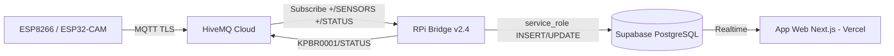
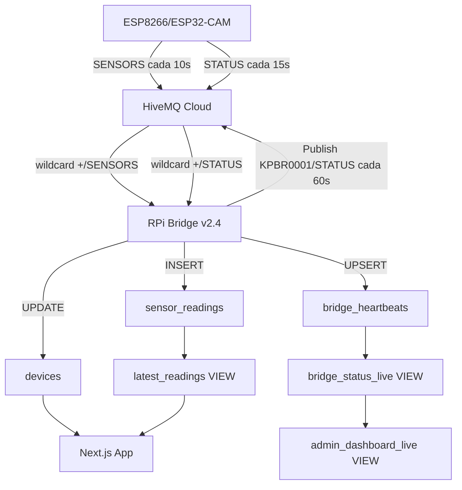

# Diagrama de Arquitectura Actual (Kittypau)

> Nota: Este diagrama esta en Mermaid. Puedes exportarlo a PNG/SVG desde cualquier editor Mermaid.

## Flujo detallado

## Notas
- Bridge escribe directamente a Supabase (service_role), NO pasa por webhook API.
- Bridge auto-registra dispositivos desconocidos con `device_state: 'factory'`.
- Bridge actualiza `device_state: 'linked'` en cada STATUS recibido.
- Bridge publica telemetria propia como KPBR0001/STATUS cada 60s.
